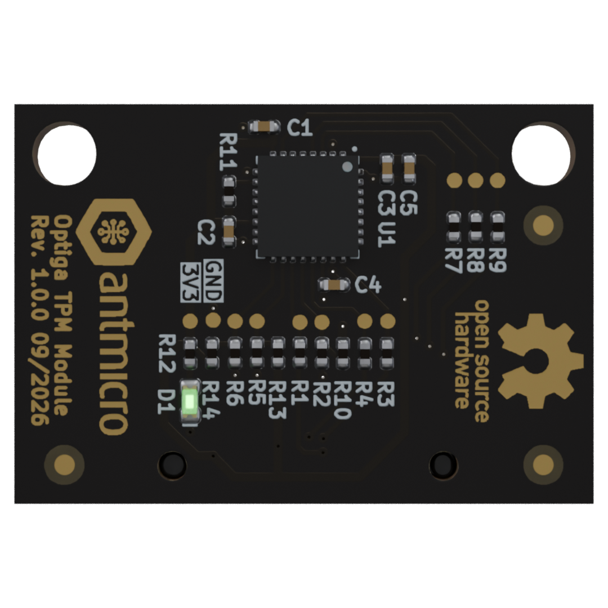

# Optiga TPM Module

Copyright (c) 2026 [Antmicro](https://www.antmicro.com)

## Overview

This project contains open hardware design files for a TPM 2.0 module based on the Infineon OPTIGA TPM SLB 9672. TPM module provides an SPI-connected TPM 2.0 IC for embedded systems, IoT, networking equipment, telecommunications infrastructure and consumer electronics.
It provides a foundation for securely establihing the identity and software status of connected devices.
The board connects to a host via SPI protocol and 3 GPIO pins. 
The Optiga TPM Module can be connected to various platforms with ERF5 40-pin board to board connector. All signals are exposed on testpads. 

## Key features

* TPM 2.0 compliant
* PQC-protected firmware update mechanism
* 40-pin ERF5 connector (compatible with Antmicro CM4 Baseboard)
* All signals exposed on testpads 
* 20 x 29 mm (0.78 x 1.14 inch) PCB outline

## Project structure

The main directory contains KiCad PCB project files, the LICENSE, and this README, and the img directory contains graphics for this README.

## License

This project is licensed under the [Apache-2.0](LICENSE) license. 
